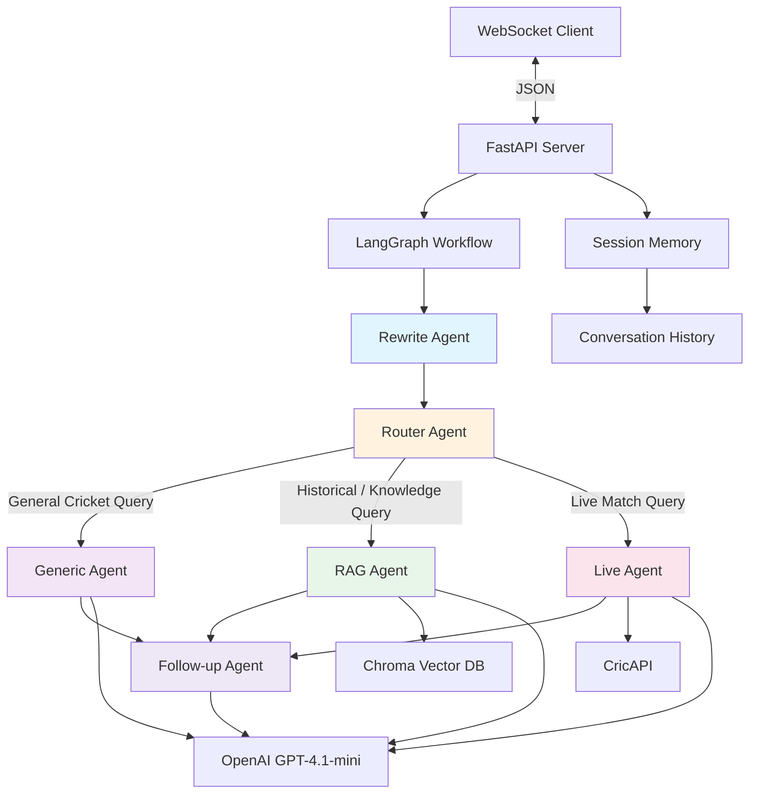

# Cricket RAG Chatbot

A chatbot that answers cricket-related questions and provides live match data and updates.

## System Architecture



## Features

* Real-time cricket match updates
* Cricket knowledge Q&A
* RAG-based retrieval using vector database
* Live cricket API integration
* Conversational memory support
* Multi-agent workflow using LangGraph
* WebSocket-based streaming responses

## Tech Stack

* FastAPI
* LangGraph
* LangChain
* LangSmith
* OpenAI GPT-4.1-mini
* ChromaDB
* WebSockets
* CricAPI

```
```
