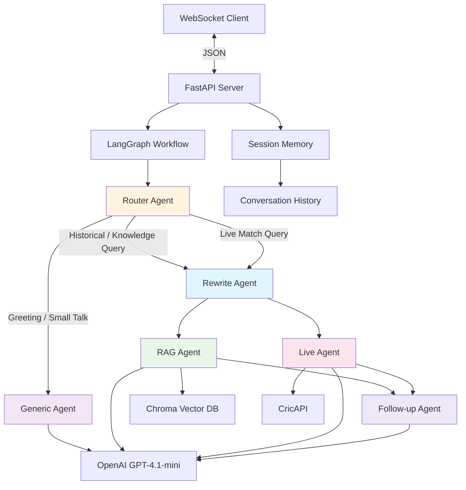

# Cricket RAG Chatbot

A chatbot that answers cricket-related questions and provides live match data and updates.

## System Architecture


```mermaid
graph TD

    A["WebSocket Client"] <-->|JSON| B["FastAPI Server"]

    B --> C["LangGraph Workflow"]

    C --> D["Router Agent"]

    D -->|Greeting / Small Talk| E1["Generic Agent"]

    D -->|Historical / Knowledge Query| R["Rewrite Agent"]
    D -->|Live Match Query| R

    R --> E2["RAG Agent"]
    R --> E3["Live Agent"]

    E2 --> F["Follow-up Agent"]
    E3 --> F

    E2 --> G1["Chroma Vector DB"]
    E3 --> G2["CricAPI"]

    E1 --> H["OpenAI GPT-4.1-mini"]
    E2 --> H
    E3 --> H
    F --> H

    B --> I["Session Memory"]
    I --> I1["Conversation History"]

    style D fill:#fff3e0
    style R fill:#e1f5fe
    style E1 fill:#f3e5f5
    style E2 fill:#e8f5e9
    style E3 fill:#fce4ec
    style F fill:#ede7f6
```

## LangGraph Flow

```text
START
  │
  ▼
Router
  │
  ├── Greeting / Small Talk
  │       │
  │       ▼
  │   Generic Agent
  │       │
  │       ▼
  │      END
  │
  ├── Live Query
  │       │
  │       ▼
  │   Rewrite Agent
  │       │
  │       ▼
  │    Live Agent
  │       │
  │       ▼
  │   Follow-up Agent
  │       │
  │       ▼
  │      END
  │
  └── Knowledge Query
          │
          ▼
      Rewrite Agent
          │
          ▼
       RAG Agent
          │
          ▼
      Follow-up Agent
          │
          ▼
         END

```
## Tech Stack

### Backend
- FastAPI
- WebSockets
- LangGraph
- LangChain
- OpenAI GPT-4.1-mini
- SQLAlchemy
- PostgreSQL
- JWT Authentication

### Retrieval & AI
- ChromaDB (Vector Database)
- Retrieval-Augmented Generation (RAG)
- OpenAI Embeddings
- LangSmith (Tracing & Monitoring)

### Data Sources
- CricAPI (Live Cricket Data)

### Frontend
- Angular
- TypeScript
- HTML
- CSS

### Infrastructure
- Docker
- Render (Deployment)

### Database Schema
- Users Table
  - Email
  - Hashed Password
  - Created Timestamp


